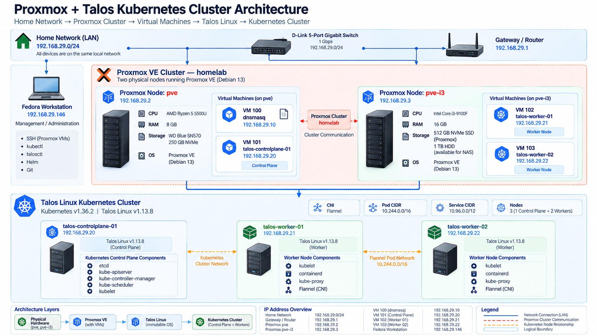

# Homelab Kubernetes Platform

A self-hosted Kubernetes platform built on **Proxmox VE + Talos Linux**, managed through declarative configuration and GitOps.

This repository is both a production-style homelab and a practical Kubernetes/CKA learning environment. It covers cluster infrastructure, Kubernetes networking, TLS, storage, GitOps, platform services, application workloads, and hands-on Kubernetes labs.

> **Current architecture:** 2 Proxmox hosts → Talos Kubernetes cluster → 1 control plane + 2 workers, with MetalLB, Gateway/Ingress components, cert-manager, Cloudflare integration, NFS CSI storage, Argo CD, and application Helm charts.

---

## Architecture

```text
                              Internet
                                 │
                                 ▼
                           Cloudflare DNS
                                 │
                    ┌────────────┴────────────┐
                    │                         │
             Cloudflare Tunnel          Public DNS/TLS
                    │                         │
                    ▼                         ▼
             cloudflared                 MetalLB / Gateway
                    │                         │
                    └────────────┬────────────┘
                                 │
                                 ▼
                     ┌─────────────────────────┐
                     │   Talos Kubernetes      │
                     │      1.36.2             │
                     └────────────┬────────────┘
                                  │
              ┌───────────────────┼───────────────────┐
              │                   │                   │
              ▼                   ▼                   ▼
       Control Plane         Worker 01            Worker 02
       192.168.29.20       192.168.29.21        192.168.29.22
              │                   │                   │
              └───────────────────┼───────────────────┘
                                  │
                   ┌──────────────┴──────────────┐
                   │                             │
               Argo CD                     Platform Services
                   │                             │
          ┌────────┴────────┐             Homepage / Monitoring
          │                 │
       Helm Apps       Infrastructure
          │                 │
   ┌──────┼──────┐    ┌─────┼──────────────┐
   │      │      │    │     │              │
Linkding Nextcloud Portfolio MetalLB cert-manager NFS CSI
```

The current infrastructure is split across two physical Proxmox VE
hosts.

<div align="center">
  
</div>


The repository is intentionally split into infrastructure, platform services, applications, labs, and documentation so each layer can evolve independently.

---

## Repository Map

```text
homelab/
├── assets/                 Architecture diagrams and images
├── docs/                   Detailed operational and setup documentation
├── kubernetes/
│   ├── applications/       Application Helm charts
│   ├── argocd/             Argo CD applications and bootstrap
│   ├── infrastructure/     Cluster infrastructure components
│   ├── platform/           Shared platform services
│   └── README.md
├── labs/                   CKA-oriented Kubernetes experiments
├── proxmox/                Proxmox infrastructure as Terraform
├── scripts/                Operational/helper scripts
├── talos/                  Talos machine configuration and patches
└── README.md
```

Start with:

- [Kubernetes Platform](kubernetes/README.md)
- [Talos](talos/README.md)
- [Proxmox](proxmox/README.md)

---

## Infrastructure Stack

| Layer | Technology |
|---|---|
| Virtualization | Proxmox VE |
| Kubernetes OS | Talos Linux |
| Kubernetes | v1.36.2 |
| Container runtime | containerd 2.2.6 |
| CNI | Flannel |
| Load balancing | MetalLB |
| Gateway / ingress | Gateway API + Traefik/Ingress components |
| TLS | cert-manager + Let's Encrypt |
| External DNS / edge | Cloudflare |
| Tunnel | cloudflared |
| Storage | NFS CSI |
| GitOps | Argo CD |
| Application packaging | Helm |
| Internal DNS | Pi-hole |
| IaC for Proxmox | Terraform |

---

## Current Cluster

| Node | Role | IP | Proxmox Host |
|---|---|---|---|
| `talos-controlplane-01` | Control plane | `192.168.29.20` | `pve` |
| `talos-worker-01` | Worker | `192.168.29.21` | `pve-i3` |
| `talos-worker-02` | Worker | `192.168.29.22` | `pve-i3` |

### Cluster networking

```text
LAN:             192.168.29.0/24
Gateway:         192.168.29.1
Pi-hole:         192.168.29.10

Pod CIDR:        10.244.0.0/16
Service CIDR:    10.96.0.0/12

Kubernetes API:  https://192.168.29.20:6443
```

The cluster intentionally remains a **single-control-plane** deployment. It is suitable for learning and homelab workloads but is not an HA control plane.

---

## Kubernetes Repository Structure

### `kubernetes/infrastructure`

Cluster-level components that provide capabilities to workloads:

```text
infrastructure/
├── networking/
│   ├── cert-manager/
│   ├── cloudflared/
│   ├── gateway-api/
│   └── metallb/
├── security/
└── storage/
    └── nfs/
```

### `kubernetes/platform`

Shared services used by the platform itself:

```text
platform/
├── argocd/
├── homepage/
└── monitoring/
```

### `kubernetes/applications`

Workload-specific Helm charts:

```text
applications/
├── linkding/
├── nextcloud/
└── portfolio/
```

### `kubernetes/argocd`

GitOps control plane:

```text
argocd/
├── bootstrap/
│   └── root.yaml
└── applications/
    ├── applications.yaml
    ├── infrastructure.yaml
    ├── platform.yaml
    └── workloads/
        ├── linkding.yaml
        ├── nextcloud.yaml
        └── portfolio.yaml
```

---

## GitOps Model

Argo CD is the reconciliation layer for the Kubernetes repository.

```text
Git repository
      │
      ▼
 Argo CD
      │
      ├── Infrastructure
      │     ├── MetalLB
      │     ├── cert-manager
      │     ├── Gateway API
      │     ├── cloudflared
      │     └── NFS
      │
      ├── Platform
      │     ├── Argo CD
      │     ├── Homepage
      │     └── Monitoring
      │
      └── Applications
            ├── Linkding
            ├── Nextcloud
            └── Portfolio
```

The intended operating model is:

> Change Git → Argo CD reconciles → Kubernetes reaches the declared state.

---

## Storage

The cluster uses an external NAS/NFS architecture rather than local Kubernetes disks for persistent application data.

```text
Application
    │
    ▼
PVC
    │
    ▼
StorageClass
    │
    ▼
NFS CSI driver
    │
    ▼
NFS server / NAS
```

See [Kubernetes NFS CSI Integration](docs/Kubernetes-NFS-CSI-Integration.md).

---

## TLS and Networking

The repository contains multiple networking layers:

- MetalLB provides `LoadBalancer` IP allocation.
- Gateway API provides modern Kubernetes traffic routing.
- Existing ingress resources are retained where applications still use them.
- cert-manager obtains and renews certificates.
- Cloudflare provides DNS and external edge functionality.
- cloudflared provides tunnel-based exposure where required.

See:

- [MetalLB](docs/MetalLB-Setup.md)
- [TLS](docs/Kubernetes-TLS.md)
- [Homelab TLS Setup](docs/Homelab-TLS-Setup.md)
- [Pi-hole Internal DNS](docs/Pihole-Internal-DNS.md)

---

## Applications

Current Helm-managed workloads include:

### Linkding

A lightweight bookmark management application with:

- Deployment
- Service
- PVC
- TLS certificate
- IngressRoute

### Nextcloud

A stateful application stack containing:

- Nextcloud
- PostgreSQL StatefulSet
- Redis
- Persistent storage
- Services
- TLS
- Ingress

### Portfolio

A web application using:

- Deployment
- Service
- Gateway API
- HTTPRoute
- EnvoyProxy configuration
- TLS

Application-specific configuration belongs under `kubernetes/applications`.

---

## Platform Services

Current platform layer:

### Argo CD

GitOps reconciliation and application lifecycle management.

### Homepage

Internal platform dashboard for exposing links and cluster services.

### Monitoring

Monitoring-related platform resources and secrets are maintained under:

```text
kubernetes/platform/monitoring/
```

The monitoring stack is intentionally kept separate from application workloads.

---

## CKA Labs

The `labs/` directory is a separate learning track.

```text
labs/
├── 01-pod
├── 02-replicaset
├── 03-deployment
├── 04-daemonset
├── ...
└── 26-pod-anti-affinity
```

Each lab is designed to be:

1. Reproducible.
2. Easy to inspect.
3. Easy to break intentionally.
4. Useful for CKA troubleshooting practice.

The labs are deliberately kept separate from production-style cluster manifests.

---

## Proxmox Infrastructure

Proxmox configuration is managed under:

```text
proxmox/
```

Terraform files describe:

- Providers
- Cluster configuration
- Network configuration
- Storage
- VMs
- Outputs
- Variables

The Terraform state and variable files require special handling and should not be committed if they contain credentials, secrets, or environment-specific sensitive data.

---

## Talos Configuration

Talos configuration is maintained under:

```text
talos/
├── patches/
├── generate-configs.sh
├── controlplane.yaml
├── worker.yaml
└── secrets/
```

Generated Talos credentials and machine configuration must be treated as sensitive.

The reusable patches describe node-specific configuration such as:

- Hostnames
- Static networking
- Kubernetes endpoint
- API server SANs
- Worker disk/network configuration

See [Talos README](../talos/README.md).

---

## Security

This repository is intended to be version-controlled infrastructure.

Never commit:

- Talos secrets
- `talosconfig`
- Kubernetes admin credentials
- API tokens
- Cloudflare tunnel tokens
- Private keys
- Passwords
- Cloud credentials
- Sensitive Terraform state
- Sensitive `terraform.tfvars`

Before committing:

```bash
git status
git diff --cached --name-only
git diff --cached
```

Also verify ignored files:

```bash
git check-ignore -v <file>
```

---

## Operational Philosophy

This homelab follows a layered approach:

```text
Physical / Virtual Infrastructure
            ↓
        Talos Linux
            ↓
       Kubernetes
            ↓
      Infrastructure
            ↓
         Platform
            ↓
      Applications
            ↓
      GitOps lifecycle
```

A component should live at the lowest layer that logically owns it.

For example:

- Proxmox VM definitions → `proxmox/`
- Talos machine configuration → `talos/`
- MetalLB → `kubernetes/infrastructure/`
- Argo CD → `kubernetes/platform/` and `kubernetes/argocd/`
- Linkding → `kubernetes/applications/linkding/`
- CKA exercises → `labs/`

---

## Verification

Basic cluster checks:

```bash
kubectl get nodes -o wide
kubectl get pods -A
kubectl get svc -A
kubectl get pvc -A
kubectl get storageclass
kubectl get gateway -A
kubectl get httproute -A
kubectl get certificates -A
kubectl get applications -A
```

Talos:

```bash
talosctl version
talosctl get members
talosctl get etcdmembers
talosctl get machinestatus
talosctl services
talosctl health
```

---

## Documentation

Detailed procedures live in `docs/` rather than the root README.

```text
docs/
├── Architecture.md
├── Operations.md
├── Proxmox-Homelab-Setup.md
├── Pihole-Setup.md
├── Pihole-Internal-DNS.md
├── NAS-Setup.md
├── Kubernetes-NFS-CSI-Integration.md
├── MetalLB-Setup.md
├── Kubernetes-TLS.md
└── Homelab-TLS-Setup.md
```

The root README is intentionally an **overview**, not a complete runbook.

---

## Project Goals

The homelab is being used to build practical skills in:

- Kubernetes administration
- CKA preparation
- Talos Linux
- Proxmox
- GitOps
- Helm
- Kubernetes networking
- Gateway API
- TLS and certificate management
- DNS
- Persistent storage
- NFS CSI
- RBAC and security
- Observability
- Application operations
- Infrastructure as Code
- Platform engineering

---

## Current Direction

The repository has moved beyond a basic Kubernetes cluster and is now structured as a small platform:

```text
Infrastructure
     │
     ├── Proxmox
     ├── Talos
     └── NFS

Kubernetes Infrastructure
     │
     ├── MetalLB
     ├── cert-manager
     ├── Gateway API
     └── cloudflared

Platform
     │
     ├── Argo CD
     ├── Homepage
     └── Monitoring

Workloads
     │
     ├── Linkding
     ├── Nextcloud
     └── Portfolio

Learning
     │
     └── CKA labs
```

This separation is the primary organizational model for the repository going forward.
